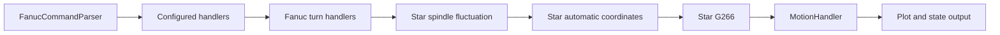
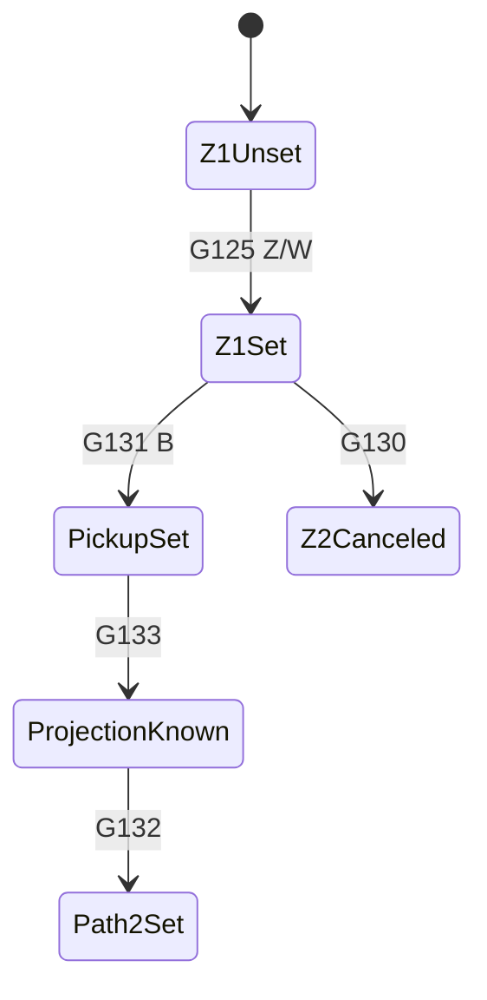

# Star SD-26G G-Code Inventory and Implementation Plan

## Scope and Evidence

This is the implementation inventory for the Star SD-26 type G with FANUC
31i-B5 Plus. The command inventory was extracted from the supplied Star
operation manual. The functional baseline is the supplied FANUC 30i/31i/32i
lathe manual. Machine-builder documentation takes precedence whenever a Star
command changes the standard FANUC meaning.

Status is deliberately strict:

| Status | Meaning |
|---|---|
| Implemented | A handler changes `CNCState` or returns motion, with a focused test. |
| Partial | Some behavior exists, but arguments, modal state, validation, or machine semantics are incomplete. |
| Recognized only | The parser accepts the token, but no handler implements its semantics. |
| Not implemented | No execution behavior exists. |

`Recognized only` must not be advertised as support. The FANUC parser accepts
generic `G` words, so tokenization is not a capability check.

## Current Execution Chain

For each configured `FANUC_STAR_*` machine, the current chain is built from
`supported_gcode_groups` in `src/ncplot7py/config/machines.json` and executed
in that order. `UniversalConfigDrivenCanal` inserts `star_turn` before
`motion` for a `TURN_MILL` machine.



The implementation rule is one independently deliverable chain link per
command family: validate the block, update a documented Star state key, then
transform the command for an existing downstream handler or return its own
tool path. A link always delegates when it does not own the G-code.

## Complete Manual Token Inventory

The following are all distinct `G` tokens found in the supplied Star manual
extraction. A token can appear in a feature table, format, alarm, or command
description; use the command section and option availability for implementation.

| Codes | Function family | Current status | Implementation target |
|---|---|---|---|
| `G0`, `G1`, `G2`, `G3` | Rapid, linear, circular interpolation | Implemented | Keep in `MotionHandler`; add Star-axis/path regression fixtures. |
| `G4` | Dwell | Partial | Model dwell duration (`P` or supported address) instead of only consuming words. |
| `G5` | Manual-reference token; exact option/function to verify | Not implemented | Do not implement until the command section identifies its Star meaning. |
| `G10`, `G11` | Programmable data input / cancel | Not implemented | Add an offset-data link with a transaction-style state update and range checks. |
| `G17`, `G18`, `G19` | Plane selection | Implemented | `group_16_plane`; retain tests for turning default `G18`. |
| `G20`, `G21` | Inch / metric | Implemented | `FanucTurnUnitHandler` selects units and normalizes new linear/feed words without converting stored state. |
| `G25`, `G26` | Spindle-speed fluctuation detection | Implemented | `StarSpindleFluctuationHandler` tracks monitoring OFF/ON; actual-speed alarm simulation remains future work. |
| `G28`, `G30` | Reference-position return | Partial / not implemented | `G28` has a coordinate rewrite; implement two-leg motion and `G30` reference selection. |
| `G32` | Threading | Not implemented | Add a threading path link after feed/spindle validation. |
| `G34`, `G35` | Variable-lead / CW circular threading | Not implemented | Implement after the base synchronized threading model. |
| `G36` | Optional CCW circular threading | Implemented | `FanucG36CircularThreadingHandler` validates the machine option, lead, spindle state, and emits an `ARC_CCW/FEED` primitive. |
| `G40`, `G41`, `G42` | Tool-nose radius compensation | Not implemented | Add compensation state and geometry offsetting before Star cycles. |
| `G43.5` | 3D/5-axis tool compensation token | Not implemented | Separate optional 5-axis link; do not combine with lathe nose compensation. |
| `G50` | Spindle limit / coordinate setting | Partial | Existing links cover basic coordinate rewrite and spindle limit; separate the semantics and validate arguments. |
| `G65`, `G66`, `G67` | Custom macro call / modal call / cancel | Not implemented | Reuse macro execution only after call-stack and modal-call semantics are specified. |
| `G68.1`, `G69.1` | 3D coordinate conversion / cancel | Not implemented | Add a transform-stack link and enforce Star incompatibilities. |
| `G75` | FANUC outer/inner diameter drilling cycle | Not implemented | Implement canonical FANUC geometry, then validate Star restrictions. |
| `G76` | FANUC two-block multiple threading cycle | Implemented | `FanucG76ThreadingCycleHandler` validates setup/cutting blocks, schedules rough/finish depths, and emits classified pass primitives. |
| `G80`, `G83`, `G84`, `G85`, `G87`, `G89` | Drilling, tapping, boring cycles | Implemented | `FanucTurnDrillingCycleHandler` expands modal cycles into classified `G00` rapid and `G01` feed primitives; further machine alarm restrictions can be layered on it. |
| `G90`, `G94` | Turning / facing cycles | Partial / not implemented | `G90` distance mode exists; lathe-cycle behavior remains missing. |
| `G92` | Straight/taper threading cycle | Implemented | `FanucG92ThreadingCycleHandler` implements modal four-operation threading with `X/U`, `Z/W`, `R`, `F`, and `Q`. |
| `G96`, `G97` | Constant surface speed / fixed RPM | Implemented | `group_2_speed_mode`; add max-RPM and spindle-selection behavior. |
| `G98`, `G99` | Feed per minute / revolution | Implemented | `group_5_feed_mode`; make motion duration consume the selected mode. |
| `G107` | Cylindrical interpolation | Not implemented | Add a cylindrical-coordinate transform before `MotionHandler`. |
| `G112`, `G113` | Polar interpolation / cancel | Implemented / partial | `group_21_polar` covers transformation; add Star mode and conflict validation. |
| `G117`, `G118`, `G119` | Manual-reference tokens; exact function to verify | Not implemented | Hold until the command section identifies exact semantics. |
| `G125`, `G130`, `G131`, `G132`, `G133` | Star automatic coordinate setting | Partial | `StarAutomaticCoordinateHandler` validates formats and sequence state; proprietary coordinate formulas remain missing. |
| `G161` | Star Step Cycle Pro | Recognized only | Add an option-gated chip-break cycle; enforce `G97`, `G99`, and `M41` prerequisites. |
| `G164`, `G165` | Star eccentric machining cycle | Recognized only | Add option-gated cycle behavior; validate `A`/`B`, `C`/`D`, speed, and allowed words. |
| `G170`-`G174` | Star machine modes / path restrictions | Recognized only | Implement modal mode state first; commands must be isolated blocks. |
| `G180`, `G181` | Star power-driven-tool operation | Recognized only | Add tool/spindle state, then implement `T`, `S`, and `L` requirements. |
| `G190`, `G191` | Star machine coordinate/process commands | Recognized only | Add isolated-block validation and documented state effects. |
| `G251` | Polygon machining | Recognized only | Add optional polygon synchronization after spindle phase state exists. |
| `G264`, `G265`, `G266`, `G267`, `G269` | Star process/setup cycles | Partial (`G266` only) | `StarG266Handler` validates allowed/required numeric words and maps known variables; machine-specific ranges remain missing. |
| `G300` | Star-reserved/auxiliary command | Recognized only | Replace the current no-op with documented behavior or an unsupported diagnostic. |
| `G553`, `G561` | Manual-reference tokens; exact function to verify | Not implemented | Do not infer semantics from alarm references. |
| `G784`, `G884`, `G984` | Star cut-off process cycles | Recognized only | Implement independent cycle links with axis-specific formats and coolant/tool checks. |
| `G900`, `G910`, `G920` | Star B1-axis tilting / setup | Recognized only | Add B-axis setup state, tool-range, modal, and single-block validation. |
| `G990`, `G991` | Star B-axis machining / related operation | Recognized only | Add mode and transformation links after `G900/G910/G920`, enforcing alarm preconditions. |

## Baseline Comparison

The FANUC lathe manual is the source of truth for standard behavior. Implement
the shared baseline once and reuse it for Star:

1. Modal/interpolation: `G0-G4`, `G17-G19`, `G20/G21`, `G90/G91`,
   `G96/G97`, `G98/G99`.
2. Coordinate/offset: `G10/G11`, `G28/G30`, `G40-G42`, `G50`.
3. Turning/drilling cycles: `G32`, `G34-G36`, `G70-G76`, `G80-G89`,
   `G90/G92/G94`.
4. Transforms/live tooling: `G107`, `G112/G113`, `G68.1/G69.1`.
5. Star-only process and automatic-coordinate codes in dedicated links.

Option-dependent commands need capability flags in `MachineConfig` or a Star
capability object. A missing option must yield a structured NC error, never a
silent no-op.

## Delivery Plan: One Chain Link per Change

1. Add shared G-code normalization that preserves decimal codes and an
   `unsupported_g_code` diagnostic at the chain end. Test that a parsed but
   unsupported Star code fails visibly.
2. Implement the foundations: `G20/G21`, complete `G28/G30`, `G10/G11`, and
   `G40-G42`. These state changes are prerequisites for safe cycle work.
3. Implement `G125`, `G130`, `G131`, `G132`, and `G133` as separate methods in
   a Star automatic-coordinate link. Test path and modal exclusions from alarms.
4. Implement Star mode/setup links: `G170-G174`, `G180/G181`, `G190/G191`, and
   `G900/G910/G920/G990/G991`.
5. Implement standard FANUC cycles before Star `G161`, `G164/G165`,
   `G264-G267/G269`, and `G784/G884/G984`. Each cycle gets its own fixture and
   expected geometry.
6. Implement advanced transforms: `G107`, complete `G112/G113`, `G251`, then
   `G68.1/G69.1` and `G43.5`. Make every transform reversible in `CNCState`.
7. Add capability matrix tests and an SD-26G two-path conformance suite.

## Acceptance Criteria for Every Link

- Parses documented format, including required and forbidden words.
- Rejects invalid modal combinations with a structured NC error.
- Stores documented state and delegates to the next link when complete.
- Emits correct geometry and duration for a cutting or positioning command.
- Includes valid and invalid-format unit tests.
- Includes a two-path integration test whenever path ownership, synchronization,
  spindle, or axis state changes.

## Verified Current Coverage Summary

- `G0-G3` are implemented by `MotionHandler`.
- `G20/G21` are implemented in the separate FANUC turning module
   `fanuc_turn_cnc/unit_handler.py`.
- Planes (`G17-G19`), speed (`G96/G97`), and feed mode (`G98/G99`) have
  dedicated links.
- `G112/G113` has a dedicated polar link, but not all Star restrictions.
- `G25/G26` are implemented in
   `star_machine/spindle_fluctuation_handler.py`.
- `G125/G130-G133` format and dependency state are implemented in
   `star_machine/automatic_coordinate_handler.py`; coordinate calculations are
   not complete without the Star programming formulas.
- `G266` format validation and known macro-variable mapping are implemented in
   `star_machine/g266_handler.py`; machine-specific argument ranges remain.
- `StarTurnHandler` remains only as a compatibility facade for existing imports.
   Star machine configurations use the separate modules directly.
- `G300` remains a compatibility no-op and is not counted as implemented.
- Other manual codes are currently parser-recognized but not implemented unless
  covered by a standard link above.

## Implemented Module Split

The following work was completed on 2026-08-12 and is covered by focused tests:

| Layer | Configuration group | Module | Codes / behavior |
|---|---|---|---|
| FANUC turn | `fanuc_turn_units` | `fanuc_turn_cnc/unit_handler.py` | `G20/G21` input-unit mode and new-word normalization. |
| FANUC turn | `fanuc_g92_threading` | `fanuc_turn_cnc/g92_threading_cycle.py` | Modal straight/taper `G92` cycle with classified rapid/thread primitives. |
| FANUC turn | `fanuc_g76_threading` | `fanuc_turn_cnc/g76_threading_cycle.py` | Two-block `G76`, implied decimals, rough-pass scheduling, and finishing passes. |
| FANUC turn | `fanuc_g36_circular_threading` | `fanuc_turn_cnc/g36_circular_threading.py` | Option-gated CCW circular threading with `G36` source metadata. |
| Star | `star_spindle_fluctuation` | `star_machine/spindle_fluctuation_handler.py` | `G25/G26` monitoring state and conflict validation. |
| Star | `star_automatic_coordinate` | `star_machine/automatic_coordinate_handler.py` | `G125/G130-G133` formats, prerequisites, and state sequence. |
| Star | `star_g266` | `star_machine/g266_handler.py` | `G266` allowed/required words, numeric validation, and known variable mapping. |
| Star compatibility | Not configured | `star_machine/star_turn_handler.py` | Facade only; delegates to the separate Star modules. |

The machine configuration now explicitly selects control-specific tool and
M-code modules as well: `fanuc_tool_handler`, `fanuc_turn_mcode_modal`,
`fanuc_mill_mcode_modal`, `star_fanuc_tool_handler`, `star_mcode_modal`,
`siemens_tool_handler`, and `siemens_mill_mcode_modal`. The former implicit
`star_turn` injection has been removed, so handler ownership and order are
visible in each machine profile.

Verification after the current handler work: `251 passed, 25 subtests passed` for the full
`tests/` suite.

## How a G-Code Must Execute

Every block passes through the chain once. A correct implementation therefore
has four distinct responsibilities:

1. **Format validation**: normalize a code such as `G01` to `G1`, preserve
    decimal codes such as `G68.1`, reject unsupported words, require mandatory
    words, and reject duplicate/conflicting modal commands.
2. **Machine-state validation**: read the current modal, tool, spindle, path,
    option, and coordinate-system state before making any mutation.
3. **Atomic state transition**: calculate a proposed state, validate it fully,
    then commit it. Do not pop command words before validation succeeds.
4. **Geometry or delegation**: return points and duration for a motion/cycle,
    or rewrite a validated standard command and delegate it to the next link.

Use `CNCState.clone()` for commands with several checks. The handler should
validate a clone, commit to the original only on success, and leave the node
unchanged on an error. Vendor-specific data belongs in namespaced
`state.extra` keys, for example `star.coordinate.z1_set`,
`star.mode.transfer`, or `star.cycle.step_cycle`. This prevents accidental
coupling with standard FANUC handlers.

### Standard Modal and Motion Codes

`G0-G3` are modal interpolation commands. They select a motion type and use
axis words from the current block. The existing `MotionHandler` already does
the basic work: it resolves absolute or incremental endpoints, normalizes
diameter axes, emits points, and updates final axes.

The missing standard layers must be implemented before high-level Star cycles:

| Code family | CNC meaning | Required state and implementation |
|---|---|---|
| `G20/G21` | Select inch or metric program input. Existing position, offsets, and parameters are not converted. | Store a `units` modal and conversion scale for new block words. The FANUC manual explicitly warns against converting stored offsets implicitly. Test a mode change followed by an X/Z move and verify prior offsets do not change. |
| `G10/G11` | Programmed data input and cancel. | Parse only the documented offset/parameter address set. Apply values to the appropriate offset table, not `axes`; retain a reversible input mode if the Star format needs `G11` cancellation. |
| `G28/G30` | Reference return. | Expand to two motions: current point to intermediate commanded point, then intermediate point to configured reference. `G28` must validate its Star-allowed words (`X/Y/Z/U/V/W/C/H/B`); `G30` needs a configured reference number. |
| `G40-G42` | Cancel / left / right lathe tool-nose compensation. | Store compensation mode, tool radius, and tool orientation. Offset only the generated linear/arc geometry, perform corner intersection/interference checks, and cancel before coordinate, mode, and Star cycle commands that the manual prohibits. |
| `G50` | Star uses both coordinate setting and maximum-spindle-speed semantics. | Split by words: an `S`-only spindle-limit form updates `star.spindle.max_rpm`; coordinate words update the work coordinate transform. Do not let one interpretation consume the other. |
| `G96/G97`, `G98/G99` | Surface speed/fixed RPM and feed-per-minute/feed-per-revolution. | The mode links exist, but `MotionHandler` must calculate timing from RPM in `G99`, and Star validators must reject incompatible modes before a cycle starts. |

### Standard Cycle and Transform Codes

Cycles must be generated as explicit primitive moves, not treated as one
opaque command. That lets the plot, duration calculation, and collision checks
see the actual retracts and cutting passes.

| Code family | How it works | Implementation approach |
|---|---|---|
| `G32`, `G34-G36` | Synchronized threading: axis travel follows spindle phase; variable/circular forms modify lead/path. | Define a spindle-phase model first. Generate pitch-derived segments with deterministic start phase. Reject missing spindle/feed/lead data. |
| `G70-G76`, `G90/G92/G94` | Lathe stock removal, finishing, threading, turning, and facing cycles. | Parse the profile/cycle parameters into a cycle dataclass, generate a sequence of `G0/G1/G2/G3` primitives, and feed them through the geometry layer. Keep each cycle in a separate executor. |
| `G80/G83-G85/G87/G89` | Drilling, peck drilling, tapping, boring, and side variants. | Store an active drilling-cycle modal. On each position block generate approach, feed, optional dwell/pecks, and retract. `G80` clears the modal. |
| `G107` | Cylindrical interpolation maps linear travel to a rotary axis around a configured diameter. | Add a reversible coordinate transform that maps unwrapped linear motion to C-axis angle. Apply before geometry; preserve original program coordinates for diagnostics. |
| `G112/G113` | Polar interpolation on the configured Star polar axis. | The existing handler transforms coordinates. Add an explicit `star.polar.active` modal and validate the manual exclusions before switching mode. |
| `G68.1/G69.1`, `G43.5` | 3D coordinate conversion and tool-axis compensation. | Represent transforms as an ordered stack. Each transform converts target vectors and orientation; cancellation removes only its own transform. This must be implemented after compensation, not inside `MotionHandler`. |

## Star-Specific State Machines

The Star codes below are not generic FANUC extensions. They need explicit,
testable state machines and must never silently fall through to generic motion.

### Automatic Coordinate Setting: `G125`, `G130-G133`

This family prepares machining around Z1/Z2 and part transfer. The manual
confirms the state dependencies:



The exact calculation formulas require the Star programming documentation, but
the safe implementation contract is already clear:

- `G125` accepts only `Z` and/or `W`; record the Z1 reference and whether it
   was defined. It is incompatible with `G41/G42`.
- `G130`, `G132`, and `G133` are isolated blocks; reject all extra words.
- `G131` accepts only optional `B`, requires stopped Z1 and prior `G125`.
- `G133` requires prior `G131`; it calculates/stores the projection needed by
   `G132`.
- `G132` requires that projection. All family members reject active nose
   compensation; `G125` must additionally validate the configured Z1 travel.

Implement this first as validation and state tracking. Add coordinate
calculation only after obtaining the Star command-description pages, then
compare calculated coordinate origins against machine examples.

### Step Cycle Pro: `G161`

`G161` is a Star option-gated chip-breaking cycle. From the Star alarm table,
the confirmed block contract is:

```text
G161 A... F... D... Q...
```

- Allowed words are exactly `A`, `F`, `D`, and `Q`.
- It requires feed-per-revolution (`G99`), fixed RPM (`G97`, therefore not
   `G96`), and `M41` mode.
- It needs the Step Cycle Pro option when running in MACHINING mode.

Implement an initially conservative executor:

1. Validate options and all modal prerequisites before mutating state.
2. Validate the exact word set and numeric ranges from the programming manual.
3. Store a typed `StepCycleParameters` object under `star.cycle.step_cycle`.
4. If the manual specifies a motion pattern, expand it into alternating cut and
    retract primitives. Until that pattern is documented, return a structured
    “geometry unavailable” error after validation rather than inventing a path.
5. Test valid setup plus one test for each confirmed rejection: `G96`, `G98`,
    `M40`, missing option, and an extra word.

### Eccentric Cycle: `G164/G165`

These are option-dependent eccentric machining cycles. The manual confirms
their allowed word set: `A B C D E F I J K S P U V W X Y Z`; it also requires
`B < A`, `D < C`, and an `S` value within the machine upper limit.

Model them as a `StarEccentricCycle` dataclass. First validate address set,
pairs, speed, and option. Then calculate the eccentric offset as a function of
spindle angle and apply it through a transform during generated machining
primitives. The actual meanings of the named arguments and the phase formula
must come from the command-description section; alarm constraints alone are
not enough to safely derive it.

### Process and Setup Commands: `G170-G174`, `G180/G181`, `G190/G191`

These commands control machine/path/tool modes, rather than a simple axis
move. Implement them as isolated-mode transitions:

- `G170-G174` must be sole commands in their blocks. `G173` is path-specific:
   X/Y are invalid on PATH2 and Z is invalid on PATH1.
- `G180` is an isolated setup command.
- `G181` allows only `T`, `S`, and `L`, and requires all three. It rejects
   constant-surface-speed mode and a rotating power-driven tool.
- `G190` is isolated; `G191` allows only `Z`.

Use explicit enum values in `state.extra` rather than booleans. Each transition
must validate its predecessor state and update tool/path ownership only after
validation succeeds.

### Star Process Cycles: `G264-G269`

Treat these as separate executors because their formats and synchronization
rules differ:

| Code | Confirmed format rule | Minimum implementation |
|---|---|---|
| `G264` | Only `T`, `Q`; both required; only one path may execute it. | Validate, claim a shared control-level resource, store setup result, release at cycle end. |
| `G265` | Only `T`, `X`, `Y`, `Z`, `Q`; `T` and `Q` required. | Validate tool/Q/ranges, resolve axes in the owning path, generate documented positioning geometry. |
| `G266` | Only `A`, `X`, `W`, `S`, `Z`, `B`, `F`, `K`, `Q`, `T`; `A/X/W/S/Z/B/F` required. | Keep the existing variable mapping only after full validation; add range and guide-bush Z checks before commit. |
| `G267` | Only `T`, `D`, `P`, `C`, `Q`; `T` and `Q` required. | Add typed parameters and documented operation after range validation. |
| `G269` | Only `P`, `A`, `I`, `J`, `K`, `R`; `P/A/I/J/K` required. `P` is 1-32; I/J/K/R are 0-99.9. | Validate axis/path encoding in `A`, then configure the monitor without generating motion. |

Cross-path mutual exclusion cannot live only in a canal-local handler. Add a
small shared object to `UniversalConfigDrivenControl` or its synchronization
strategy so `G264` can atomically claim its resource across both paths.

### B-Axis and Multi-Path Commands: `G900/G910/G920/G990/G991`

These are a final-stage feature because they depend on tool identity, B/C-axis
ownership, path mode, compensation, spindle mode, and synchronization state.

- `G910/G920`: accept only `X` and `Z`; require the B-axis tool range
   `T1600-T1900`; reject active `G41/G42`, drilling cycles, wear offset, and
   incorrect `M171/M172` path mode.
- `G990`: isolated block; requires the B-axis tool range. It rejects nose
   compensation, drilling, `G112`, `G96`, turning/threading state, `G251`,
   axis/spindle synchronization, wrong path mode, nonzero Y, and missing C1
   reference return. Front machining also requires `M8`.
- `G991`: isolated block and has the documented PATH1/M172 exclusion.

Implement a reusable `StarModeGuard` before these handlers. It should read a
single structured `star.runtime` state object and return a specific NC error
for the failed prerequisite. The geometry/kinematics code then runs only after
the guard passes.

### Cut-Off Cycles: `G784/G884/G984`

These are Star cut-off process cycles. The confirmed format sets are
axis-specific: `G784` uses `X`/`U`, `G884` uses `Y`/`V`, and `G984` uses
`Z`/`W`, each alongside `F`, `S`, and `M`. The machine requires coolant 1 to
be enabled for cut-off processing.

Implement one shared `CutoffCycle` generator parameterized by its cutting axis:
validate the code-specific axes and `F/S/M`, validate tool/coolant state,
generate approach-cut-retract primitives, then emit an optional broken-tool
condition from simulated load data. The exact cutting/retract distances belong
to Star machining data, so make them explicit configuration fields rather than
hardcoded values.